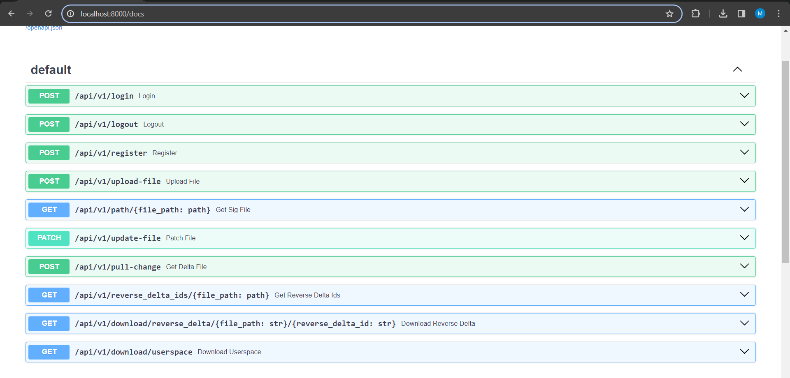

# FSS
A file synchronisation service to keep a directory in sync across multiple devices. 

## Setup Instructions
1. Clone the repository and create a file named "db_password.txt" in `fss/app/`. This will hold the password to your database.
   <br>
   
   <br><br>
   
   
   <br><br>
   
2. Create a .env file under fss/. In this file,
   define the following environment variables.
   <br>
   DB_USER=postgres (This must be postgres and shouldn't be changed)
   <br>
   DB_PASSWORD= (This must be identical to the password defined in db_password.txt)
   <br>
   DB_HOST=db (This must be db and shouldn't be changed)
   <br>
   DB_PORT=5432 (This can be any valid port but 5432 is the convention for a postgres database. If you decide to change
   it to another port number, you will also need to modify the docker-compose.yml file, specifically the ports property
   under the db service)
   <br>
   DB_NAME=fss (This must be fss)
   <br>
   USERSPACES= (This can be any valid path within the backend container)
   <br>
   
   <br><br>
   
3. Run the following command from within the fss directory
   <br>
   ```docker compose up```
   <br><br>
   
4. The services should be up and the api endpoints can now be accessed at "localhost/docs"
   
   <br><br>

## Possible issue with postgres
You may face an issue described in the following thread: https://stackoverflow.com/questions/76781095/how-do-i-fix-scram-authentication-errors-when-connecting-dbeaver-to-a-docker-pos

To solve this:
1. Delete the volumes that were created for the services.
2. Run the following command to start the database service:
   <br>
   `docker compose up db`
   <br><br>
   
3. Once the db service is up, edit the pg_hba.conf to allow all connections from all IPv4 addresses.
   
   <br><br>
   
   
   <br><br>
   
4. Restart the db service.
   <br><br>
   
5. Connect to postgres. You will not be prompted for a password.
   <br>
   
   <br><br>
   
6. Reset the password for the postgres user. The password must be identical to the password present in db_password.txt.
   <br>
   
   <br><br>
   
7. Change the allowed IPv4 addresses back to its default value in pg_hba.conf.
   <br>
   
   <br><br>
8. Restart the db service. Run `docker compose up` and the backend will now be able to access the database.